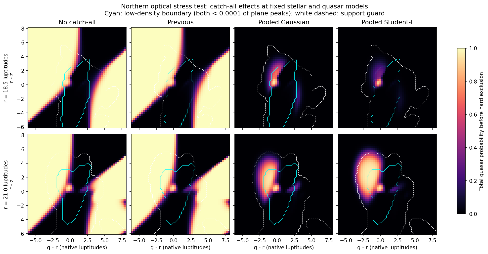

# Gaussian and Student-t catch-alls on the active PSF model

The pooled Student-t is active in `models/multisurvey_psf/current`
(bundle `630f47f63b6f0694`). The Gaussian comparison is the complete loadable
bundle `models/multisurvey_psf/5b6f779d34853645`. Quasar mixtures, the joint
stellar mixture, spatial weights, surface-density priors and photometric
transform are byte-identical to the preceding bundle `068549008f3c74f7`.
Only the catch-all has changed. Both alternatives work with any nonempty subset
of 41 bands, through the same marginalisation and reference-band conditioning.

The Student-t is preferred by predictive cross-validation and by every reserved
field cone. Both improve the northern stress failure. Neither alone establishes
that every low-density region is trustworthy, so the hard support exclusion
remains required. These tests are not a full probability calibration.

## What was reused from history

- `ddb1892` (26 September): one joint Gaussian envelope, checked against every
  component covariance, with consistent marginalisation and conditioning.
- `f09de39` (26 September): a Student-t at the field's scale. The earlier broad
  Gaussian was too diffuse in intermediate colour regions. Its published
  numbers describe the earlier all-morphology model, not the current PSF fit.
- `406cabf` (27 September): Student-t convolution with Gaussian measurement
  noise via its Gaussian scale-mixture integral. This prevents a band with huge
  uncertainty from affecting the conditional density as if it were informative.
  The active 41-band catch-all now uses this evaluator. Its numerical quadrature
  remains covered by closed-form and uninformative-band tests; the Cholesky
  whitening now uses solves rather than an explicit inverse.

## What was fitted

Both families are centred on the joint field mixture's mean. The Gaussian
covariance strictly exceeds every quasar and field component covariance. Its
chosen width is 1.02 times the minimum dominant scale of the envelope. The
Student-t uses the field mixture's covariance as its scale matrix, with selected
degrees of freedom 4 and scale factor 1. Measurement noise is convolved before
conditioning; missing bands are marginalised in the same joint distribution.

Each magnitude-bin catch-all fraction maximises the mixture log likelihood
plus `n0 * [eta_global*log(eta) + (1-eta_global)*log(1-eta)]`. This is a
Beta-prior MAP fit. The global fraction has a weak Beta(2,2) prior, equivalent
to one pseudo-count for each population. Empty or uninformative bins borrow
the global fraction. This is a declared statistical assumption, not a
post-processing floor on probabilities. All fitted fractions are positive.

Three-fold cross-validation held out whole cones among the 18 training cones,
using 23,899 objects excluded from the Gaussian-shape fit. The spatial weights
had already used those training cones: this tests the catch-all conditionally
on that fixed spatial model. Scale, degrees of freedom, 3/6/12 magnitude bins
and pooling strengths 100/1000/10000 were compared. The two families were frozen
before evaluating the six original reserved cones (14,511 objects).

The **stellar colour model is continuous in magnitude**, obtained by
conditioning the joint mixture. These catch-all bins do not discretise it.
Stellar surface-density histograms separately have 5–21 bins depending on band
(19 for southern r, 17 for northern r).

| Quantity | Gaussian | Student-t |
|---|---:|---:|
| Selected catch-all bins per well-sampled reference band | 6 | 3 |
| Selected pooling strength | 1000 | 1000 |
| Cross-validation gain over field alone, nats/object | 0.000212 | 0.002122 |
| Reserved-field gain over field alone, nats/object | 0.007407 | 0.018649 |
| Minimum fraction encountered on reserved objects | 0.0000775 | 0.001677 |

The previous Student-t gives 0.018697 nats/object on the same reserved field
objects. Thus this change preserves its predictive performance rather than
claiming a further improvement over it. The benefit is removing switched-off
protection and using the proper noise convolution. The previous fractions
included two exact zeros and a northern value about 2e-310. Reference bands
without enough calibration objects use a pooled global fraction; they do not
receive an invented separate fit.

## Stress tests and real-object checks

Six optical colour planes (north/south at reference luptitudes 18.5, 21 and
24.3), each with 2,601 grid points, were scored at primary redshift 1.8. The
low-density probes use both total quasar intensity and stellar intensity below
1% or 0.01% of their respective peaks on the same plane. These are explicit
stress-test definitions, not calibrated support boundaries or labelled stars.

In the bright northern plane, among 2,224 points below the 0.01% threshold:

| Total quasar probability above 0.5 | Previous | Gaussian | Student-t |
|---|---:|---:|---:|
| Before the hard support guard | 1471 | 2 | 0 |
| After the hard support guard | 379 | 2 | 0 |

The result is not universal. At northern r=21, the same probe leaves 62 points
above 0.5 with the Gaussian and 144 with Student-t after the guard. Their
same-redshift ranks at z0=1.8 are low (maximum log R over this probe is -9.43
and -9.51 respectively); a high total-quasar probability is not a high
same-redshift probability. This does not certify other primary redshifts, nor
make the nearest-component support guard an empirical coverage test. A
low-density/peak ratio alone can also mark a genuine low-weight quasar locus:
the maximum-rank point under the 1% probe at northern r=21 lies just 0.096
Mahalanobis units from a quasar component. We therefore report the complete
planes rather than treating every high grid score as an observed error.



The independent real-object scoring check sampled 512 reserved quasars and 512
reserved field objects with an explicit seed. Of these, 427 and 450 were
eligible with finite baseline ranks. All variants put the same 388 eligible
quasars and one eligible field object above total quasar probability 0.5. The
Student-t changes held-out quasar log R by a median -9.2e-9, with the 5th–95th
percentiles [-0.000331, +0.000017]. Field objects are not a perfectly labelled
non-quasar sample, so the latter count is not a measured false-positive rate.

Both families additionally pass analytic marginalisation checks for every one
of the 41 singletons, all 820 pairs and 39 larger subsets. A complete public
scorer check reproduces the fast intensity-update calculation and confirms
that outside-both-models objects have NaN probabilities/ranks and are ineligible.

## Reproduction

The complete grids, folds, fitted settings and counts are recorded in
`configs/psf_catchall_comparison.json` and
`docs/VALIDATION_psf_catchalls_2026-09-28.json`. Private training caches remain
under `models/multisurvey_psf/work/`. No close-pair catalogue was used.

```bash
python scripts/compare_psf_catchalls.py
python scripts/validate_psf_catchalls.py
MPLBACKEND=Agg python scripts/plot_psf_catchalls.py
python -m pytest -q
```

To compare the saved alternatives through the same guarded interface:

```python
student_t = PSFMultiSurveyBaseline.load("models/multisurvey_psf/current")
gaussian = PSFMultiSurveyBaseline.load("models/multisurvey_psf/5b6f779d34853645")
```

Six held-out cones and two optical systems do not establish performance for
every band subset, sky position or redshift. Mathematical marginalisation
checks establish correct computation, not empirical calibration of every
subset. The unchanged fits retain their earlier iteration-cap limitations.
