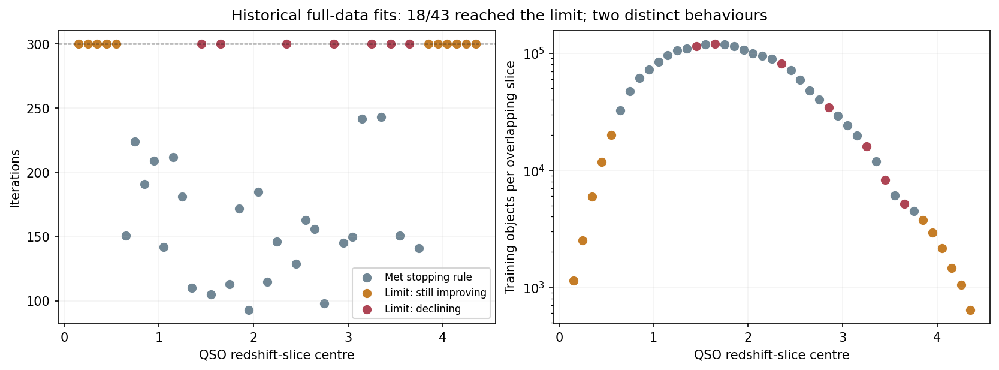
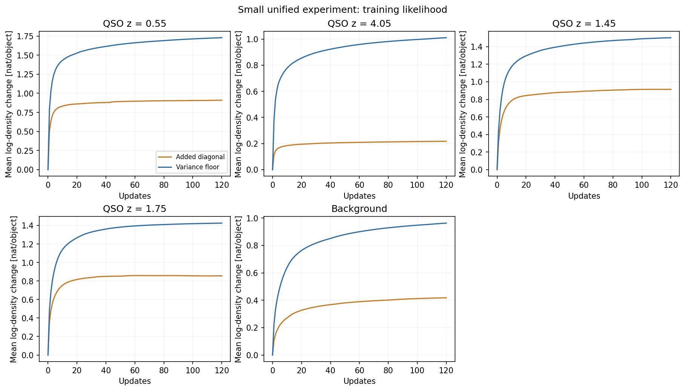
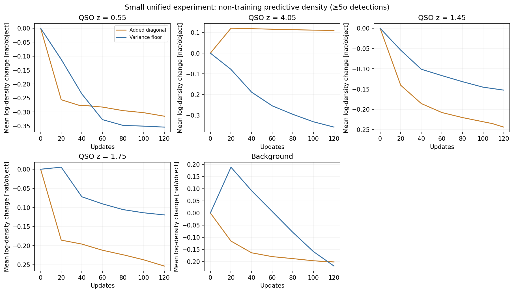

# Iteration limits: frequency, significance and quick remedies

**The issue is common as an optimizer warning, but it has not made the larger
model generally worse.** It combines slow improvement with a separate
regularization-related deterioration. A 206-second unified-model experiment
supports testing a less stringent tolerance and validation-based early
stopping; it does not support globally replacing the covariance update.
No production setting or active model was changed, and no full fit was run.

## How often, and where?

The historical full-data model has 43 QSO slices. It is the predecessor of the
planned unified refit; the latter has not run, so its cap frequency is unknown.

| Historical outcome at 300 iterations | QSO fits | Situation |
|---|---:|---|
| Met stopping rule | 25/43 (58%) | Mostly intermediate redshifts |
| Hit limit, still improving | 11/43 (26%) | Slice centres z=0.15–0.55 and 3.85–4.35 |
| Hit limit, declining likelihood | 7/43 (16%) | z=1.45, 1.65, 2.35, 2.85, 3.25, 3.45, 3.65 |

Thus **18/43 (42%)** hit the cap. The one stellar/background model also hit it.
The earlier small active model was not universally converged either: only
20/43 QSO slices met its stopping rule, and its background did not.

Slowly improving QSO slices contain 640–20,080 objects each. They account for
only 2.5% of training **slice memberships**, since the problematic endpoints
are lightly populated. Overlapping slices reuse objects; this is not a unique
object fraction. The declining group accounts for 18.1% of memberships and
includes slices with 114,657 and 119,828 objects. Sparse data alone therefore
cannot explain it. Covariance/noise/missing-band complexity is a plausible
contributor to slow EM, not a separately established cause in this audit.

## Is this a big scientific problem?

The saved full-data versus small-data comparison found mean held-out
conditional log-density improvements of **+0.357 nats/QSO and +0.231
nats/background object**, despite the full model's iteration-limit flags.
These are density improvements, not accuracy or calibrated probability gains.

The saved extra-100-iteration experiment converged only two of the eleven
slow QSO slices; nine and the background still reached 400. The aggregate
held-out QSO density change was **+0.000255 nat/object**, with its sky-bootstrap
interval spanning zero. The stellar global mixture gained **+0.0142**, much
less than the gain from using the larger training set. Its continuation had
no newly fitted spatial weights; keep that distinction when interpreting it.

There are consequential individual changes: the stellar diagnostic's 95th
percentile absolute conditional-density change was 0.163 nat; for z=0.55 it
was 0.945 nat. These are training-row sensitivity measurements, not demonstrated
classification errors. The correct conclusion is **diminishing average benefit
with some moving tails**, rather than either universal stability or a broken
classifier. Source: `FULL_VS_SMALL_HEALTH_2026-09-30.md` and
`CONVERGENCE_CONTINUATION_RESULTS_2026-09-30.json`.

The seven declining fits are a distinct optimization issue. Earlier full-data
one-step comparisons implicated adding the fixed covariance diagonal: six of
seven next steps declined with it, all seven improved without it. A constrained
minimum-eigenvalue update improved every one of 140 subsequent diagnostic
steps, but none of those seven fits converged in that 20-step trial. It repaired
likelihood direction; it did not establish faster convergence or better
out-of-sample predictions.

## New quick test in the unified coordinates

Five cases: low-z slow (0.55), high-z slow (4.05), declining (1.45), previously
converged control (1.75), and background. Each uses the same fixed **2,048
fit/select objects** for both updates, with the full model's K and southern
canonical warm start. Weak/negative measurements remain. These are explicit
diagnostic subsamples, not a change to production's uncapped sample.

Ten runs used four workers and 120 iterations each. All 41 native channels and
36 latent coordinates remain. Held-out development evaluations use up to 256
objects per hemisphere and at least one >=5-sigma detection; they are not
training rows. They have been inspected, so this is not an untouched final
audit. Predictions are conditional densities of the selected QSO slice or
global background, not complete spatial/catch-all classification scores.

The experimental additive step was tested against the production projected
kernel; constrained steps were tested for likelihood increase and the variance
bound. Production code and prepared full-run identity remain unchanged.

| Case | First stop at 1e-5 | First stop at 1e-4 | Mean held-out gain from continuing 1e-4 stop to 120 | Floor minus additive at 120 |
|---|---:|---:|---:|---:|
| QSO z=0.55 | >120 | 38 | -0.0382 | -0.0391 |
| QSO z=4.05 | >120 | 46 | -0.0083 | -0.4675 |
| QSO z=1.45 | 109 | 100 | -0.0132 | +0.0913 |
| QSO z=1.75 | 81 | 59 | -0.0422 | +0.1339 |
| Background | >120 | 105 | -0.0034 | -0.0169 |

The last two columns are nats/object; positive means higher predictive density.
Stopping indices replay the existing nonnegative relative-gain criterion on
the stored trajectory; runs deliberately continued to 120 for comparison. Indices count completed
updates; the production kernel's pre-update history logging has a one-step
reporting offset.
All five floor runs still missed 1e-5 at 120. They had zero decreasing training
steps; additive runs had seven at z=1.45 and 39 at z=1.75.

Loosening tolerance saves updates in all five examples and loses no average
held-out density relative to 120. This does not imply every prediction is
unchanged: the 95th percentile absolute change ranges from 0.055 to 0.701 nats.
Neither ranking equivalence nor a full-data stopping-time forecast is certified.

The floor removes systematic covariance inflation but does not retain the same
statistical shrinkage. It helps two cases and hurts three, especially high-z.
**Do not promote it globally merely because its training curve is monotone.**
Most small-sample runs also lose predictive density relative to their already
full-data-trained warm start: this is consistent with fitting flexibility to
only 2,048 objects. It is a limitation of this cheap experiment, not evidence
that the full-data unified refit will degrade.

## Best practice and pragmatic recommendation

Three different tools address different situations:

- **Slow but useful progress:** warm starts, a justified tolerance, and bounded
  continuation of the affected fits. A tighter tolerance is not automatically
  scientifically better. The 1e-4 option is the promising cheap candidate here.
- **Unproductive extra fitting:** validation-based early stopping that actually
  stops and retains the best predictive checkpoint, rather than only displaying
  a monitor. Define a fixed non-training stopping sample separately from final
  assessment and rejection calibration. Report this as predictive early
  stopping, not mathematical convergence. This is a proposed production policy,
  not an implemented or independently certified result of this test.
- **Deteriorating updates:** use an explicitly defined regularized objective or
  constrained update, and verify predictive consequences. A variance floor is
  an established constraint, but the test rejects a blanket switch at the
  current setting. EM acceleration such as SQUAREM is an option for genuinely
  slow fixed-point convergence; it was not tested here and is not the first
  recommendation while extra optimization often adds no predictive value.

The next bounded action is to set the production stopping policy: retain the
current tested covariance update, use the 1e-4 candidate with checkpoint
selection on a separate non-training development sample, and check the final
complete-score ranking before activation. Retain 300 as a ceiling rather than
a target. Do not require every fit to clear 1e-5, extend all fits automatically,
launch a K search, or change rejection thresholds to hide density changes.
No production tolerance change has been made by this audit. A less stringent tolerance
changes the numerical stopping requirement; it does not magically
solve the same strict optimization problem faster.

The small test supports a way to avoid unproductive computation. It does not
prove a universal cure for capped fits, or certify a new regularization method.

References: [constrained mixture covariance updates](https://arxiv.org/html/1306.5824)
and [Varadhan and Roland's EM acceleration work](https://biostats.bepress.com/jhubiostat/paper63/).
The project-specific conclusions above come from the saved comparisons.

## Artifacts

- `configs/unified_convergence_probe.json`
- `scripts/probe_unified_convergence.py`, `scripts/summarize_unified_convergence.py`
- `docs/CONVERGENCE_FREQUENCY_2026-09-30.json`
- `docs/UNIFIED_CONVERGENCE_PROBE_2026-09-30.json`
- `docs/UNIFIED_CONVERGENCE_COMPARISON_2026-09-30.json`
- `models/multisurvey_psf/work/unified_convergence_probe/20260930/d820e0835ac64b92/`
- Runtime **206.2 seconds**; `/tmp/unified_convergence_probe.log`.
- Numerical kernel tests: 2 passed. Full suite: **368 passed in 82.59 seconds**;
  `/tmp/unified_convergence_fullsuite.log`.
