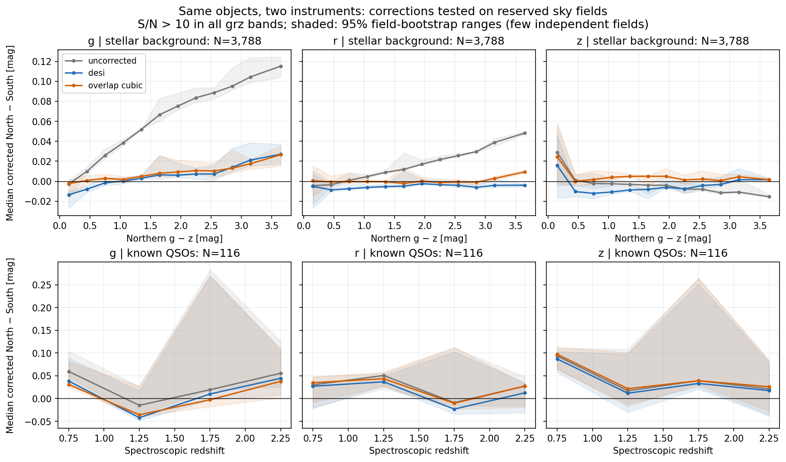
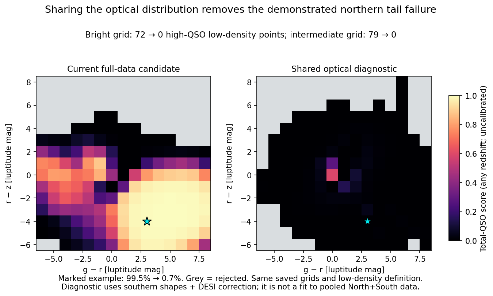

# Legacy North-South unification experiments — 30 September 2026

The overlap measurements support DESI's correction as a starting point for a
shared PSF model. They do not establish exact photometric equivalence or validate
a pooled production fit. The active model remains unchanged. The user requires
the measurement-model design to be discussed before further implementation or
pooled retraining.

## Same-object correction test

The experiment reuses local stellar-source caches. It finds 34,522 unique
reciprocal North-South pairs within 0.35 arcsec across 13 fields, including 454
known QSO matches. Both counterparts pass the available r-band fracflux cut;
g/z fracflux measurements are not available in these caches. Frozen field roles
are retained. The cubic fit uses 3,042 high-S/N stellar-background objects in
three fit/selection fields, excluding known QSOs. The bright evaluation uses
3,788 stellar-background objects and 116 known QSOs in three calibration/test
fields, requiring S/N > 10 in both systems' g/r/z. These cuts define this
calibration comparison, not the science-candidate selection.

The alternatives are no correction, the DESI North-to-South relation, and a
new DR9 cubic fit following the overlap-calibration approach of Duncan (2022).
The cubic coefficients are not the published DR8 coefficients.

Median corrected-north minus measured-south residuals in native asinh magnitudes:

| Population and correction | g [mag] | r [mag] | z [mag] |
| --- | ---: | ---: | ---: |
| Stellar background, uncorrected | 0.0622 | 0.0152 | -0.0064 |
| Stellar background, DESI | 0.0041 | -0.0057 | -0.0053 |
| Stellar background, cubic | 0.0070 | 0.0002 | 0.0026 |
| QSO, uncorrected | 0.0194 | 0.0213 | 0.0401 |
| QSO, DESI | 0.0047 | 0.0108 | 0.0332 |
| QSO, cubic | 0.0023 | 0.0257 | 0.0391 |

DESI reduces stellar g-band robust scatter from 0.0576 to 0.0296 mag. QSO
scatter after DESI remains 0.194/0.129/0.119 mag in g/r/z. The stellar colour
trend is substantially reduced, but residual colour dependence remains. The
cubic has no clear overall QSO advantage. The small number of independent
fields and QSOs limits conclusions about redshift-dependent corrections.
The cause of the QSO scatter has not been isolated; it must not all be
interpreted as intrinsic transformation uncertainty.

The exact DESI ordinary-magnitude test gives similar bright-source medians:
0.0046/-0.0054/-0.0052 mag for stars and 0.0050/0.0129/0.0341 mag for QSOs.
Applying the affine magnitude relation to asinh magnitudes is an experimental
extension, not an exact transformation at faint or negative flux. Additional
complete-grz comparisons retain all S/N and negative measurements: 9,988
stellar-background objects and 150 QSOs. Full results are in
[the photometry report](LEGACY_UNIFICATION_PHOTOMETRY_2026-09-30.json).



WISE same-object bright comparisons give median North-South differences of
-0.00263 mag in W1 (5,287 pairs) and -0.00088 mag in W2 (2,255 pairs). Native
asinh softenings differ and catalogue residual tails remain. A common flux
convention and treatment of repeated/correlated measurements are still needed.

## Shared-distribution diagnostic

The diagnostic retains the completed full-sample candidate's southern marginal
distributions and predicts northern g/r/z through a noisy affine relation. It
does not fit pooled northern and southern data. It keeps all 41 input labels
and exact Gaussian marginalisation for observed subsets, including single
northern bands, within this approximate affine model. Only g/r/z are tied;
Legacy W1/W2 remain separate. Priors, spatial weights and the catch-all are
numerically inherited and explicitly marked as diagnostic calibrations.

The extra covariance is total paired fit-field residual covariance, including
measurement noise. It is not a deconvolved intrinsic covariance and may double
count measurement noise. It must not be copied unchanged into production.

On the original fixed low-density grid selection, high total-QSO scores fall
from 72 to zero at the bright northern magnitude and from 79 to zero at the
intermediate magnitude. The explicit unsupported example falls from 0.995064
to 0.007128. These are artificial test points, not a contamination-rate estimate.
On the saved small real-object sample, Legacy-optical AUC changes from 0.985869
to 0.987830 and all-available-band AUC from 0.974327 to 0.974762. Five additional
background rows become ineligible in the all-band test. This is encouraging
evidence for sharing, not full calibration. It does not separate the effect of
sharing shapes from that of the correction and added scatter.



See [the diagnostic report](LEGACY_UNIFICATION_SHARED_DENSITY_2026-09-30.json).

## Reproduction and preserved locations

Configuration: `configs/legacy_unification_test.json`.
Run from the repository with the project virtual environment:

```bash
python scripts/test_legacy_unification.py
python scripts/test_shared_legacy_density.py
python scripts/plot_legacy_unification_results.py
```

These scripts run local diagnostics, not acquisition or production fitting.
The raw cache root is
`models/multisurvey_psf/work/full_sample_preparation/stellar_sources/`.
The photometry JSON records each contributing file and its hash. Frozen roles
come from `models/multisurvey_psf/work/stellar_preparation/2d43d81d0b5f2af0/spatial_roles.json`;
QSO identities come from
`models/multisurvey_psf/work/full_sample_photometry/e2615aaa39862aff/targets.npz`.

Saved paired measurements, correction coefficients and local report:
`models/multisurvey_psf/work/legacy_unification/20260930/`
(`overlap_pairs.npz`, `corrections.npz`, `photometry_report.json`).
The diagnostic bundle and scores are in its
`shared_optical_3db05ecc8781b2f0/` subdirectory. These large local caches are not
Git artifacts. Code, configuration, reports and PNG figures are versioned.

`tests/test_legacy_homogenization.py` checks covariance propagation, the cubic
Jacobian, all seven nonempty northern-optical subsets against independent
Gaussian calculations, joint North-South covariance, negative flux and invalid
residual covariance. The completed experiment passed the full suite:
349 tests in 82.23 seconds (`/tmp/legacy_unification_tests.log`).

## Proposed next step

Discuss the production measurement relation first: uncertainty, faint/negative
flux, arbitrary missing bands, possible QSO redshift dependence and WISE
conventions. Apply the relation to all PSF-like inputs, not only presumed QSOs.
If adopted, pooled training requires joint QSO and stellar refits, updated
spatial mixture weights, rebuilt catch-all calibration and review of affected
reference-band priors. Reuse the existing data and frozen roles. Validate
reserved-source performance by hemisphere, redshift, magnitude and band subset,
as well as the original tails, before considering activation.

Sources previously inspected:
[DESI correction](https://desitarget.readthedocs.io/en/latest/_modules/desitarget/cuts.html#shift_photo_north)
and [Duncan (2022)](https://academic.oup.com/mnras/article/512/3/3662/6544645).

## Review of the user's external design proposal

Status: recommendations for discussion, not an approved implementation or a
new fitted model. The proposal uses a common latent distribution and predicts
native observations through a linear operator, with class-dependent residual
means and covariance. This is consistent with the projected-observation
formulation of [extreme deconvolution](https://arxiv.org/abs/0905.2979).
The DESI coefficients in the proposal agree with the official source checked
on 30 September. The following details matter for this repository:

- Keep 41 accepted input labels, but distinguish them from latent dimensions.
  Sharing only the three Legacy optical pairs gives 38 latent coordinates;
  sharing W1/W2 as well gives 36. The latter requires consistent softenings
  and treatment of duplicate/correlated measurements. There are 31 non-Legacy
  coordinates. A rectangular observation operator can accept either or both
  Legacy systems for the same source.
- An affine model in asinh coordinates is a practical approximation, not an
  exact consequence of DESI's ordinary-magnitude relation. Native asinh
  softenings differ. Negative measurements remain usable, but the current
  Gaussian measurement covariance is itself a first-order approximation after
  the nonlinear flux transform. Validate both approximations near the softening
  scale before deciding that a constant affine operator is adequate.
- Calibrate the relation on paired fit/selection data with uncertainty in both
  systems. Fix its convention and parameters before pooled density fitting,
  rather than allowing transformation offsets, class offsets and mixture means
  to absorb one another. Absorb the stellar residual mean into the common
  offset, or otherwise constrain that degeneracy explicitly.
- Start QSO residuals with a constant, regularized mean and simple extra
  covariance. Independent offsets in all 43 redshift slices are not supported
  by the demonstrated overlap sample. Add a smooth or coarsely pooled redshift
  dependence only if reserved predictive checks justify it. The reported 116
  bright QSOs are evaluation objects, not a new calibration-training sample;
  their reported medians must not be inserted directly as fitted offsets.
- Estimate excess residual covariance with measurement errors included in the
  likelihood. Raw paired scatter also includes possible variability and other
  effects; it is not solely filter mismatch. An unseparated scatter allowance
  is a sensitivity scenario, not guaranteed conservative classification.
- Preserve spatial stellar weights, surface densities and local refitting.
  Preserve conditioning on the measured reference band and use priors in that
  same native observed-band convention. Both the joint and reference marginal
  must use the same projected, noise-convolved distribution.
- The current XD E step selects observed coordinates; general linear mixing
  is not yet implemented in the production trainer. Extend and validate the
  serial and streaming/parallel paths consistently. The existing diagnostic
  projects fitted distributions but does not implement pooled XD training.
- The catch-all is a broad unmodelled component, not a calibrated stellar SED
  family. Its native-observation density must remain normalized and compatible
  with the new model; recalibrate its share and retest tails. Unification does
  not certify support everywhere or replace the existing guard.

Recommended sequence: settle the coordinate and residual conventions; estimate
and test the observation relation from existing paired data; then implement
projected training and perform a pooled refit if that relation is adequate.
Before promotion, compare real paired-source scores at the same sky position
with consistent priors and account for differing errors/epochs, test genuine
QSO performance and quantify high-score/low-support frequency in reserved PSF
sources. Previously inspected test objects remain useful regression examples
but must not be described as untouched validation.
