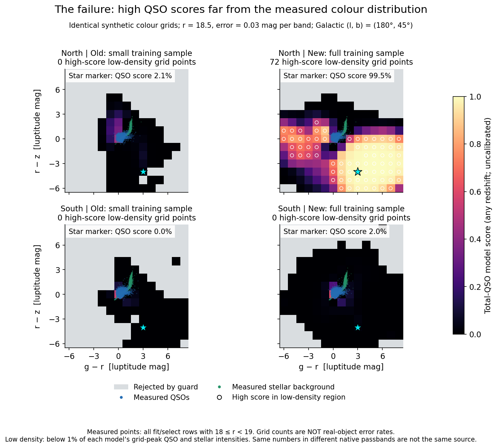
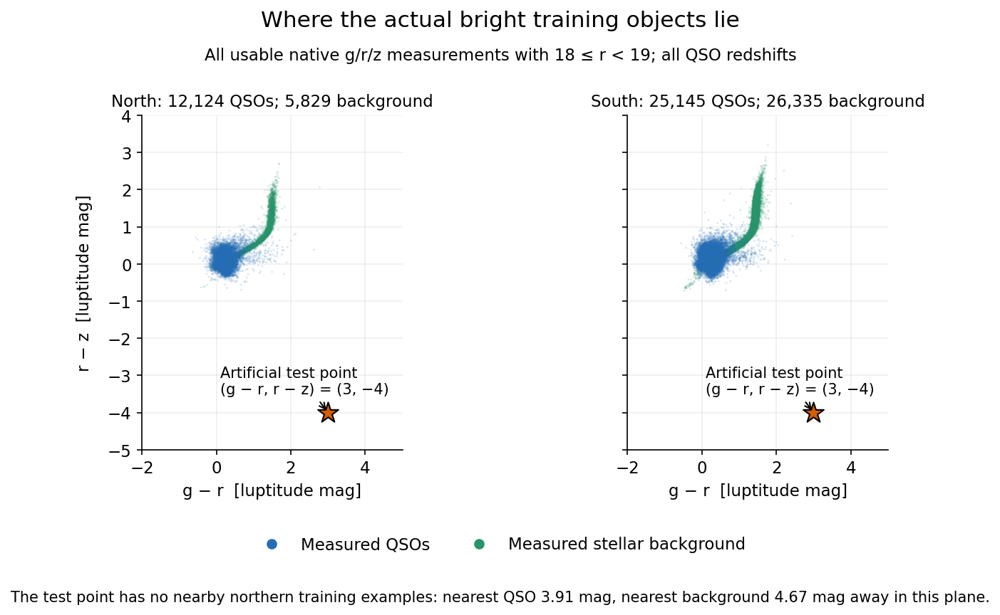
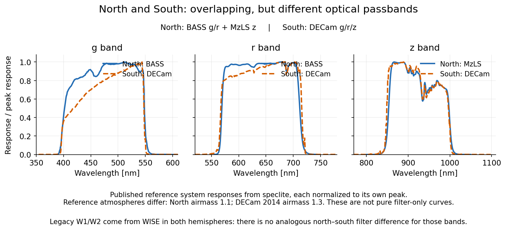
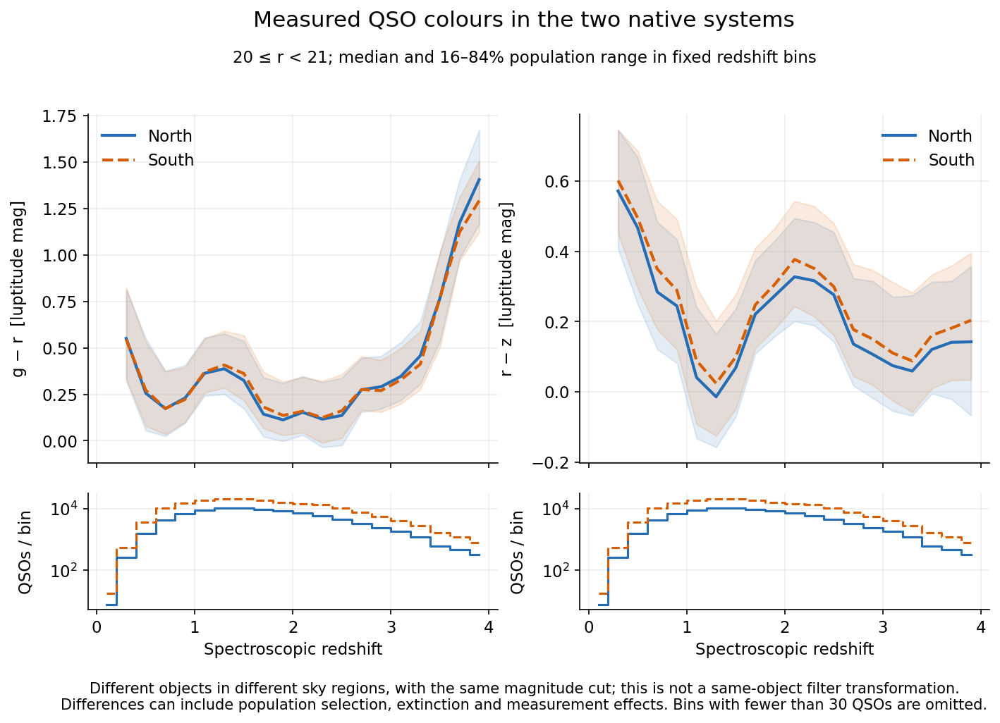

# Northern extrapolation and photometric-system comparison

The figures demonstrate an extrapolation failure on artificial inputs. They do
not establish its frequency in real candidates. The full-data candidate and
active small-data model are unchanged.

## Saved model scores

Each panel uses the same 15-by-15 grid in native g-r and r-z luptitude colours,
with reference r = 18.5 and independent 0.03-mag luptitude errors. A luptitude
is the asinh magnitude used by the model; it remains defined for negative flux.
These are the exact saved release-audit scores, with no interpolation between
grid points. Colour represents the model's total-QSO score, summed over all
redshifts; it is not the same-redshift probability or a calibrated probability.
Grey means the guard rejected the input. White rings mark accepted scores above
0.5 where both QSO and stellar intensities are below 1% of their grid peaks in
both models. There are 72 such northern points for the new model and zero for
the old; both southern models have zero on this bright grid.

The cyan star marks (g-r, r-z) = (3, -4), corresponding to native luptitudes
(g, r, z) = (21.5, 18.5, 22.5). Its northern QSO score rises from 0.0211 to
0.9951; the new southern model gives 0.0200 at the same numerical colours.
Identical numerical photometry in different native systems does not represent
the same physical source. The comparison holds the sky position fixed at
Galactic (l, b) = (180, 45) degrees; it isolates system/model behaviour rather
than comparing representative northern and southern sky populations. The
underlying audit uses a primary redshift of 1.8 and the recorded blend fixtures.

## Actual training colours

These are all eligible fit/select objects with three usable native grz
measurements and 18 <= r < 19. No random cap, positive-flux cut or signal-to-noise
cut is applied. Northern counts are 12,124 QSOs and 5,829 stellar-background
objects; southern counts are 25,145 and 26,335. The stellar background is the
cleaned PSF population, not a spectroscopically certified pure-star sample.

The nearest measured northern QSO to the marked point is 3.914 mag away in
Euclidean two-colour distance; the nearest background source is 4.668 mag away.
All QSO redshifts are included. This verifies that the example is remote from
the measured bright northern population. The plot does not measure the
occurrence rate of such photometry among real candidates.

## Optical passbands

The plot uses locally installed speclite BASS-g, BASS-r, MzLS-z and
decam2014-g/r/z reference response curves, each divided by its own maximum.
They include instrumental and atmospheric response. Their reference atmospheres
differ: airmass 1.1 for BASS/MzLS and 1.3 for DECam 2014. These are published
reference curves illustrating the instruments, not a reconstruction of each
DR9 exposure. Their metadata and plotted arrays are saved in the accompanying
JSON. Sources: [speclite response documentation](https://speclite.readthedocs.io/en/latest/filters.html)
and [Legacy DR9 photometry documentation](https://www.legacysurvey.org/dr9/description/#photometry).

The broad wavelength ranges overlap closely, but the responses differ,
particularly in g. DR9 reports native-system fluxes rather than transforming
the systems into identical passbands. W1/W2 are WISE measurements in both
hemispheres and have no analogous north/south filter distinction. Those facts
alone do not determine how much information a statistical model should share.

## Measured QSO colours versus redshift

Both samples use 20 <= r < 21, all three usable native bands and fit/select
roles. Lines show median colour in bins of width 0.2 in spectroscopic redshift;
shading shows the 16th to 84th population percentiles, not uncertainty on the
median. Bins require at least 30 objects. Lower panels show counts. Within
0 <= redshift < 4, the samples contain 86,917 northern and 183,533 southern QSOs.

The median absolute difference between the two binned median tracks is
0.0187 mag in g-r and 0.0384 mag in r-z; the largest differences are 0.1135
and 0.0654 mag. These are descriptive comparisons of different objects in
different sky regions. Selection, extinction and measurement effects can
contribute; they are not measured same-object filter transformations.

The observed tracks are close compared with the displacement of the synthetic
failure. Passband differences do not by themselves explain or justify that
failure. A larger reserved-source scoring audit is still needed to quantify
its practical impact before selecting a repair.

## Reproduction

Run `python scripts/plot_northern_tail_comparison.py` in the project environment.
Settings are in `configs/northern_review_plots.json`. The script reads the saved
release cache recorded in `docs/FULL_SAMPLE_RELEASE_2026-09-30.json`, the frozen
training inputs and the installed speclite curves. It performs no fits, scoring,
catalogue acquisition or model mutation. The four PNGs are in
`plots/northern_review/`; numeric data and provenance are in
`docs/NORTHERN_REVIEW_PLOTS_2026-09-30.json`. Grid counts are asserted against
the saved release report, and all four rendered figures were visually checked.
