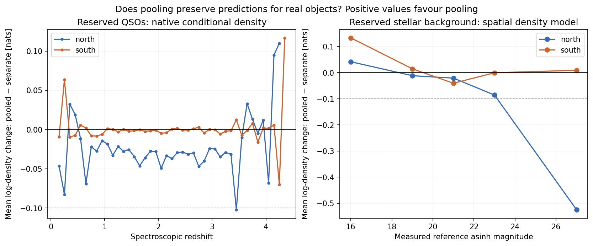
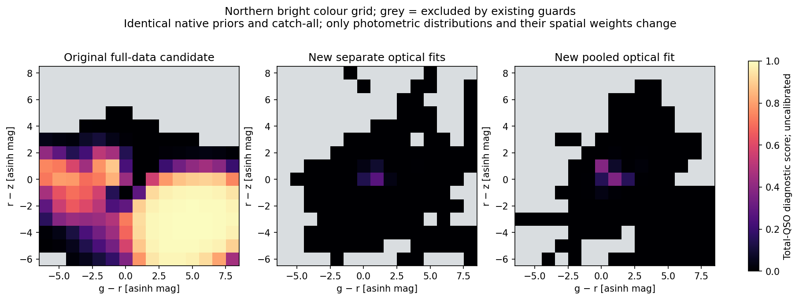

# Pooled North/South optical prototype — 30 September 2026

**Conclusion:** a shared latent photometric model is feasible and preserves QSO
ranking. This prototype removes the demonstrated northern tail failure, but
loses predictive accuracy for very faint northern stars. Keep the unification
approach; address that specific limitation before full 41-band integration.
The active model is unchanged. Fitting and validation are complete.

## What was tested

One latent Legacy grz distribution predicts the native North and South
measurements through different linear observation operators. Missing bands
are integrated out; negative fluxes remain measurements. The northern operator
uses inverse DESI slopes, with residual offsets estimated in the actual asinh
coordinates. Spatial stellar weights remain dependent on Galactic position.

The comparison fits separate native North/South models to the same rows, with
the same component counts per fit and 40-iteration budget. Separate models
have more parameters in total. All **1,049,258 eligible optical fit/select
QSOs**, all **43 redshift slices**, and **1,975,894 fit/select stars** enter;
there are no training sample caps. Two of the original training QSOs have no
usable grz measurements. Frozen calibration/test roles remain excluded from
fitting. Scoring inherits native population priors and the catch-all identically
between alternatives; these diagnostic scores are not newly calibrated
population probabilities.

The first pooled QSO fit over-broadened northern predictions when the full
paired-QSO excess scatter was added as measurement uncertainty. Replacing it
with the stellar instrumental residual covariance, retaining the QSO offset,
and refitting only the 43 pooled QSO slices reduced the northern mean density
loss from 0.790 to 0.031 nats. Paired excess can contain variability; this
experiment does not separately measure variability or prove its contribution.
The unchanged stellar and separate QSO fits were reused with saved provenance.

## Results on reserved objects

Log-density change means pooled minus separate, using natural logarithms;
positive values favour pooling. It measures prediction of observed colours
conditional on measured reference magnitude, not classification probability.

| Population | Informative test objects | Mean log-density change |
|---|---:|---:|
| Southern QSOs | 310,294 | −0.0016 |
| Northern QSOs | 58,227 | −0.0306 |
| Southern stellar background | 439,886 | +0.0038 |
| Northern stellar background | 60,825 | **−0.1706** |

The declared tolerance is a loss of at most 0.1 nats per population/hemisphere.
Northern stars fail it. Their loss is 0.021 nats at reference magnitude 20–22,
0.086 at 22–24, and **0.525 at 24–30**. The last bin contains 13,821 objects,
22.7% of northern test stars, and accounts for about 70% of the total net loss.
These are asinh magnitudes, including faint and negative measurements. A fixed
affine relation calibrated on bright sources may be inadequate there; this
test localizes the loss but does not establish its cause.

Complete-score ranking uses 512 reserved QSOs and 512 reserved background
objects per hemisphere, ranking by `log_r_per_unit_z` with a target redshift
assigned consistently between alternatives. AUC is the area under the ranking
ROC curve; larger is better.

| Hemisphere | Separate AUC | Pooled AUC | QSO completeness at ≈1% background acceptance, separate → pooled |
|---|---:|---:|---:|
| South | 0.99182 | 0.99181 | 80.3% → 80.7% |
| North | 0.98807 | 0.98759 | 73.4% → 75.0% |

QSO eligibility is unchanged (512 south, 511 north). Each alternative gives
one background object per hemisphere a total-QSO score above 0.5. This sample
shows no material ranking degradation; 512 objects cannot certify rare-tail
rates, and the background catalogue is not a perfectly labelled pure-star
sample. Background acceptance is therefore not a measured contamination rate.

For the same 694 overlap objects eligible under both models and both native
views, mean absolute North/South total-QSO score difference changes from
**0.0829 to 0.0806**. This is a small improvement. The mean signed difference
changes from −0.0378 to −0.0477, so unification does not remove every systematic
score offset. Native errors, priors and epoch differences remain relevant.

[Paired-score plot](../plots/pooled_optical_prototype/paired_scores.png).

## Original failure and remaining tails

On the original fixed northern low-density colour-grid mask, bright and
intermediate high-QSO counts change from **72 and 79 to zero**. The notorious
bright point `(g−r, r−z) = (3, −4)` changes from total-QSO score 0.995 to
5.6 × 10⁻¹⁰, while remaining eligible. **The new separate optical fits also
remove this failure.** The result establishes that pooling can preserve this
improvement; it does not attribute the improvement uniquely to pooling.

At southern reference magnitude 21, four pooled grid points remain above 0.5
under the original low-density mask, versus three in the separate optical
control and zero in the original full-data candidate. Pooled `(g−r, r−z)`
and total-QSO scores are `(2,0): 0.803`, `(3,0): 0.616`, `(-1,1): 0.582`,
and `(3,1): 0.563`. The mask is defined by the older models, so it does not
by itself establish lack of empirical support in the new fits. Retain these
points as explicit regressions; do not claim all extrapolation is cured.
Artificial grid counts are not catalogue contamination measurements. The
northern faint grid has no eligible scores under the inherited policy and
therefore provides no faint-score validation.

## Decision and bounded next step

**16 of 17 declared checks pass.** The failed check is northern stellar
predictive density. All seven nonempty grz subsets pass numerical, window
identity and support-guard checks. Functional handling of negative flux is
tested; the reserved QSO sample contains few negative measurements and none
in the north, limiting empirical conclusions for that case.

Check the faint-end observation relation in the actual asinh coordinates,
using existing fit/select overlap measurements and both measurement errors.
First establish whether the relation fails there and whether a noise-aware
calibration improves it. Only then spend compute on one targeted pooled
stellar retry, retaining the southern grid checks and the same performance
criteria. This is the recommended next task; it has not been launched.
Avoid a broad component-count or convergence campaign.

The final experiment contains 132 fits: 103 satisfy the convergence tolerance
and 29 reach the common 40-iteration budget. No recorded likelihood decreases
occur. This is a bounded comparison, not proof that every fit is optimal.
The QSO scatter adjustment used held-out diagnostics to make a model choice;
the reused reserved sample provides development evidence, not an untouched
confirmation of that choice. Independent final confirmation and full
41-band validation remain necessary before production promotion.

## Saved locations and verification

- Numerical report: [POOLED_OPTICAL_PROTOTYPE_2026-09-30.json](POOLED_OPTICAL_PROTOTYPE_2026-09-30.json).
- Original experiment: `models/multisurvey_psf/work/pooled_optical_prototype/20260930/aa79cd8f3486dee8/`.
- Final variant: that directory's `instrumental_scatter_6d29f313e9caa5d7/` subdirectory; `scatter_variant.json` records its location. Its `fits/`, `calibration.json`, `prepared.json`, `reused_fits.json`, `training_complete.json`, `report.json`, prediction arrays and native diagnostic `bundles/` preserve the experiment.
- Frozen source inputs: `models/multisurvey_psf/work/full_training_inputs/370b9a1b027c3de8/`.
- Fit/validation settings: `configs/pooled_optical_prototype.json` and `configs/pooled_optical_validation.json`; the final variant also stores `effective_config.json`.
- Implementations: `src/qso_pcolor/projected_xd.py`, `scripts/run_pooled_optical_prototype.py`, `scripts/check_pooled_qso_scatter.py`, `scripts/validate_pooled_optical_prototype.py`, and `scripts/plot_pooled_optical_prototype.py`.
- Full software suite: **354 passed in 75.75 seconds**, `/tmp/pooled_optical_validation_suite.log`. Five projected-XD tests cover identity equivalence, conditional moments, every optical subset, synthetic recovery and row accounting.
- Run logs: `/tmp/pooled_optical_training.log`, `/tmp/pooled_qso_scatter_refit.log`, `/tmp/pooled_optical_final_validation.log`.

Software tests pass; scientific validation has the one declared failure above.
No downloads occurred and the active pointer remains
`models/multisurvey_psf/630f47f63b6f0694`.
