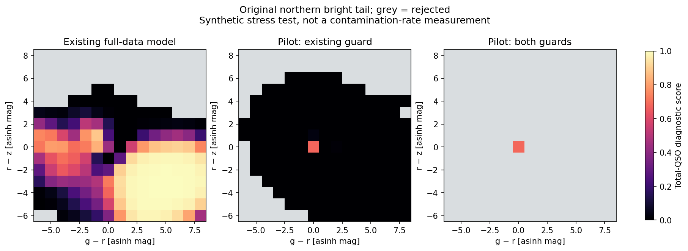
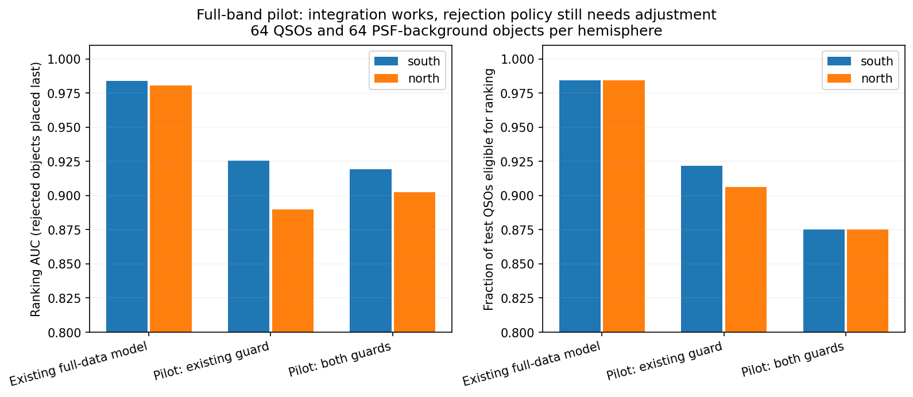
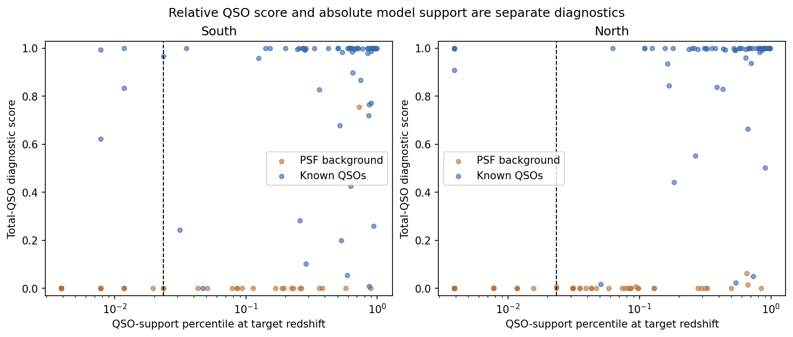

# Unified full-survey pilot: completed 30 September 2026

**The pilot supports proceeding to full-data unified retraining.** The
end-to-end pipeline works, and a matched comparison isolates unification from
training-sample size and rejection rules: all 12 density/ranking checks pass.
Rejection-policy tuning is separate and can follow retraining. The short pilot
itself is not a replacement for the active production model.

## Direct test of unification

The control uses free North/South native coordinates. Both alternatives use
the same pilot rows, component counts, initial native predictions and
eight-iteration budget. Spatial weights are fitted separately on the same
rows; abundance priors and the catch-all are identical. Neither rejection rule
enters these density/ranking comparisons, and no thresholds were changed.
The matched control and evaluation took 149.6 seconds.

| Ranking AUC, before rejection | Native-coordinate control | Unified |
|---|---:|---:|
| All available bands, South | 0.9961 | 0.9957 |
| All available bands, North | 0.9921 | 0.9925 |
| Legacy optical, South | 0.9888 | 0.9886 |
| Legacy optical, North | 0.9819 | 0.9830 |

AUC measures how often a known QSO ranks above a background object; higher is
better. Each comparison uses approximately 512 QSOs and 456–469 background
objects, restricting both models to identical finite-score rows. Missing
priors still prevent scoring some background rows; those are not silently
assigned a score. This is a ranking diagnostic, not probability calibration.

Held-out conditional density uses up to 2,000 objects per population and
hemisphere. With all available bands, mean log-density changes (unified minus
control) are **+0.014/+0.129 nats for southern/northern QSOs**, and
**+0.027/+0.069 for the corresponding PSF-background samples**. All have a
reference-band detection of at least five sigma. With Legacy optical alone,
changes are approximately zero except a northern QSO improvement of +0.037
nats. All eight density comparisons and four ranking comparisons pass the
predeclared tolerances (maximum losses 0.1 nat and 0.03 AUC respectively).
The measured ranking changes are much smaller than that tolerance.

This is evidence that tying the systems preserves useful density and ranking
performance in the tested domain. Both fits have full-data warm starts and a
short budget; the test does not establish final convergence or accuracy for
rare band combinations. The native control starts with the projected residual
covariance folded into its intrinsic covariance, whereas the unified fit keeps
that residual fixed in the observation model. The regularization is applied
in each model's own coordinates. These are limitations of a practical control,
not grounds for another prototype cycle.

## Scope and execution

The pilot fits Galactic nside=4 cells 22, 63 and 169, and tests cells 28, 62
and 170. These are small selections of the cached footprint, including North
and South. All **27,686 QSO** and **49,809 empirical PSF-contaminant** fit/select
rows in the chosen cells are used; every selected QSO enters at least one
existing redshift slice. Weak/negative measurements remain. There is no
S/N training cut or row cap. Five sigma defines the main test-object selection.

All **43 QSO slices plus one contaminant model** were fitted with four workers
and a fixed eight-iteration budget. Fitting took **86.6 seconds**; all fits
used the budget, with no recorded likelihood decreases. This is not a claim
of convergence. Spatial weights, contaminant counts and a Student-t catch-all
calibrated on all **28,673 calibration-role background rows** took another
13.2 seconds. Support calibration and the score audit took 36.0 seconds.
These are measured pilot runtimes, not a full-retraining ETA.

The 36 latent coordinates produce 41 labelled native observation channels.
Legacy North/South grz use the tested forward relation. Legacy W1/W2 share
coordinates with common softening; AllWISE remains separate. The native WISE
residual variance is recorded as 10⁻⁶ mag². Affected prior grids use the
coordinate Jacobian. Models start from canonical marginals of the completed
full-data candidate: this is a limited-area update, not independent training
from scratch. The actual classification interface accepts candidate RA/Dec,
survey-labelled fluxes/errors or AB magnitudes/errors, primary-QSO redshift,
and the existing PSF/blend requirements. Explicit native provenance takes
precedence in overlap regions; local background refits remain available.

## What passed

- The original northern bright/intermediate counts of high-QSO points under
  the fixed low-density grid mask change from **72/79 to 0/0**. Southern bright
  and intermediate grids also have zero such points. The unified density
  plus existing guard already gives zero; do not attribute the entire
  improvement to the new support cutoff.
- The software tests cover all 41 single-band marginals, projection,
  correlated-error conditioning, negative flux, redshift interpolation,
  reproducible Monte Carlo support, and position/provenance input handling.
- The empirical subset audit passes numerical, posterior-window identity and
  guard checks where data exist. It attempted 41 single bands and six random
  masks; 17 single-band cases have no measurements in the small test draw.
  Three bands (NSC u/VR and VHS H) have no training measurements anywhere in
  this pilot. Their inherited coordinates are not empirically validated by it.
- The active model pointer is unchanged. No catalogue downloads occurred.

## Separate follow-up: rejection of genuine QSOs

The new support cutoff is **0.02344**, calibrated to retain 98% of QSO
evaluations. It retains **98.2% of 614 calibration evaluations** of 192
distinct QSOs across several band masks. On the full-band test, it retains
**60/64 QSOs in each hemisphere (93.75%)**. These are the support cut alone;
the pre-existing distance guard rejects additional objects. The pilot therefore
does not demonstrate the requested high completeness on new fields.

| Full-band result | Existing full-data candidate | Pilot, old guard | Pilot, both guards |
|---|---:|---:|---:|
| Southern ranking AUC | 0.9838 | 0.9254 | 0.9192 |
| Northern ranking AUC | 0.9807 | 0.8899 | 0.9023 |
| Southern QSOs eligible / 64 | 63 | 59 | 56 |
| Northern QSOs eligible / 64 | 63 | 58 | 56 |

Both alternatives use the same preference for a >=5-sigma reference band.
AUC here places rejected objects last, so it reflects completeness loss as
well as ordering among accepted objects. The control uses the completed
full-data candidate, not the older currently active smaller model.

A read-only diagnostic isolates much of this loss. Before applying either
rejection rule, the saved intensity terms give AUC **0.9993 south / 0.9785
north**, compared with **0.9985 / 0.9958** for the control. This calculation is
not an endorsed ungated classifier. It shows that the large decline in the
table is mainly a rejection effect, with a smaller northern difference in this unequal-budget comparison.
The matched-budget comparison above resolves the unification question.

The fixed component-distance guard rejects five southern and six northern
QSOs. **Four in each hemisphere pass the new calibrated support criterion.**
Their support percentiles reach 0.33: these are not uniformly remote QSO tails.
A single component-distance threshold does not represent the same probability
content for different numbers of observed bands. The new support statistic
was designed to account for bands and errors, so stacking both rules can undo
that benefit. The existing guard remains unchanged in this pilot; no veto
was removed after inspecting the results.

Legacy-optical ranking before the new support cut stays close to the control
(south 0.9619 versus 0.9624; north 0.9512 versus 0.9658). The new support cut
again retains 60/64 QSOs in each hemisphere. SDSS-only and PS1-only checks pass
the declared ranking and support-retention tolerances. The small sample sizes
make precise completeness claims inappropriate.

Paired native-view checks use 64 reserved overlap objects. Eighteen are
eligible in both views after all cuts, with mean absolute total-QSO score
difference 0.024; support decisions agree for 87.5%. The small accepted subset
means this is not evidence of universal North/South score agreement.

## Decision and next step

**Proceed with the planned full-data unified refit.** The matched comparison
answers the immediate unification question positively. The initial 13/21
end-to-end check result below remains part of the record: its failed checks
expose rejection/completeness issues, rather than a demonstrated failure of
the shared photometric model. Do not make tuning those rules a prerequisite
for training the density model.

Use all eligible cached training rows, preserve the frozen roles, fit the
shared QSO slices and contaminant model, then rebuild spatial weights and
catch-all terms. Check convergence and repeat the held-out density/ranking
tests on the completed candidate. Tune the separate rejection policy on
calibration-role objects afterward and verify its retention before promotion.
Do not tune on test objects or reopen ultra-faint investigations.

No full-production fit or promotion has started. The active pointer remains
unchanged. This pilot is sufficient to move on to the full-data fitting step;
it is not itself a calibrated production release.

## Reproduction and saved state

- Configuration: `configs/unified_pilot.json`.
- Run: `models/multisurvey_psf/work/unified_pilot/20260930/b5c55adf3698419d/`.
- Bundle: that run's `bundle/`, with checked native model, priors, outlier,
  latent representation and support-policy files.
- Training: `scripts/run_unified_pilot.py --fit`; default is preparation only.
- Completion: `scripts/complete_unified_pilot.py`.
- Validation: `scripts/validate_unified_pilot.py`.
- Matched control: `scripts/check_unified_density_pilot.py`; numerical results
  [UNIFIED_DENSITY_CONTROL_2026-09-30.json](UNIFIED_DENSITY_CONTROL_2026-09-30.json).
- Saved-prediction diagnosis/plots: `scripts/summarize_unified_pilot.py`.
- Results: [UNIFIED_PILOT_2026-09-30.json](UNIFIED_PILOT_2026-09-30.json) and
  [UNIFIED_PILOT_GUARDS_2026-09-30.json](UNIFIED_PILOT_GUARDS_2026-09-30.json).
- Logs: `/tmp/unified_pilot_training.log`, `/tmp/unified_pilot_completion.log`,
  `/tmp/unified_pilot_validation.log`.
- Software suite: **359 passed in 70.73 seconds**,
  `/tmp/unified_pilot_final_suite.log`; the added all-41-single-band assertions
  also pass (`/tmp/unified_pilot_all_bands_tests.log`).

The full-data warm start and previously inspected test roles limit independence.
Support calibration is separate from posterior probability calibration, which
remains unfinished. Unlabelled PSF background scores measure incidence of
high scores, not spectroscopically established contamination rates.
