# Figure 10 versions for 12 survey combinations

[Download the 12-page PDF](multisurvey_examples.pdf). Each image below also opens at full resolution.

All versions use the same **5 held-out spectroscopic quasars** (Q1-Q5) and **5 unclassified field sources** (F1-F5), selected for common coverage in every survey.

The sample was drawn with seed 0, before evaluating scores, from 120 eligible quasars in 8 reserved sky blocks and 49 eligible field sources. Quasars come from 5 different blocks; all field sources come from the extra reserved overlap field (field 24). Selection requires the plotted bands to be measured and 19 < SDSS r luptitude < 21.5. This small common-coverage illustration is not a representative performance test; the [larger validation](../MULTISURVEY_VALIDATION.md) supplies those results.

Blue contours show the quasar model at the target redshift; green dashed contours show the all-source background. Both are normalised two-colour densities conditioned on the measured reference band, with all other bands marginalised and the plotted bands' measurement noise convolved before conditioning. Levels are 5%, 30%, and 80% of peak density, not enclosed probabilities. Circles mark measurements; bars and ellipses show one-sigma colour errors, including the covariance from the common reference. Axes are shared across all ten panels within each figure and include every point and its two-sigma error extent.

**Annotations use every available band in the selected surveys**, so two displayed colours need not explain the full score. `ln BF` is the natural-log quasar-at-target-z/background likelihood ratio against the field (including the unmodelled term). `ln R` is the ranking statistic, with the reference-band priors. `P_z` is `p_zmatch_given_qso` for a +/-2000 km/s window under the quasar surface density of the reference band. It assumes the object is a quasar and is not the probability of a physical companion. The same target redshift is used in the top and bottom panel of each column.

Optical bands retain their native AB calibration; ALLWISE and VHS retain Vega calibration. Colours are differences of the model's saved luptitudes, not ordinary magnitude colours at low signal-to-noise. Usable negative fluxes remain measurements. DECaLS-only (Legacy g, r, z and forced W1, W2) uses the dedicated southern Legacy background fit; all other versions use the joint background. These figures show catalogue-object photometric diagnostics, without a per-object local background fit or a claim that the sources meet a close-companion blend policy.

## Fixed objects

| ID | RA (deg) | Dec (deg) | Target z | Reserved block/field |
|---|---:|---:|---:|---:|
| Q1 | 145.8397888 | -0.7945198 | 0.27166 | 38 |
| Q2 | 339.4651511 | -8.3335089 | 0.27454 | 131 |
| Q3 | 140.1365433 | -0.2993134 | 0.33837 | 35 |
| Q4 | 24.4082496 | -1.5926308 | 1.13569 | 145 |
| Q5 | 190.9469253 | -7.9503697 | 3.30415 | 62 |
| F1 | 151.5067084 | -3.3255632 | 0.27166 | 24 |
| F2 | 151.5652728 | -3.1711441 | 0.27454 | 24 |
| F3 | 151.5752661 | -3.3239194 | 0.33837 | 24 |
| F4 | 151.5453828 | -3.2446987 | 1.13569 | 24 |
| F5 | 151.6200268 | -3.2501954 | 3.30415 | 24 |

F1-F5 have assigned target redshifts, not measured spectroscopic redshifts.

## Scores on the same objects

Natural-log Bayes factors; signs do not provide spectroscopic class labels for the field sources.

| Survey inputs | Q1 | Q2 | Q3 | Q4 | Q5 | F1 | F2 | F3 | F4 | F5 |
|---|---:|---:|---:|---:|---:|---:|---:|---:|---:|---:|
| SDSS | +1.5 | +5.6 | +2.1 | +0.2 | +8.2 | +0.5 | -4.3 | -3.3 | -20.5 | -2.0 |
| DECaLS | +5.2 | +9.2 | +7.2 | +10.0 | +10.2 | -1.7 | -10.7 | -7.4 | -38.5 | -9.7 |
| ALLWISE | +9.7 | +3.1 | -1.2 | +13.1 | +3.5 | +1.4 | -1.0 | -2.1 | -5.1 | -0.5 |
| PS1 | +1.1 | +2.1 | +4.7 | -0.8 | +2.8 | -2.9 | -9.3 | -2.2 | -21.3 | -2.8 |
| NSC | +1.5 | +0.5 | +1.0 | -1.8 | +3.0 | +0.1 | -8.3 | -4.2 | -15.1 | -3.3 |
| SkyMapper | +3.3 | +1.4 | +2.8 | +1.4 | +2.1 | +2.1 | -2.4 | +0.7 | -0.7 | +0.6 |
| VHS | +5.0 | +2.9 | +4.4 | +2.7 | +2.8 | +1.7 | -1.8 | -4.2 | +0.9 | +1.6 |
| DECaLS + ALLWISE | +14.0 | +9.6 | +4.7 | +15.8 | +6.0 | +0.7 | -10.5 | -9.6 | -36.3 | -9.7 |
| SDSS + ALLWISE | +13.3 | +9.6 | +2.3 | +16.5 | +13.6 | +1.1 | -16.0 | -17.4 | -33.3 | -3.5 |
| PS1 + ALLWISE | +12.0 | +7.9 | +5.4 | +15.0 | +5.9 | -1.2 | -21.3 | -16.9 | -39.7 | -3.9 |
| ALLWISE + VHS | +14.6 | +6.6 | +3.4 | +19.2 | +7.6 | +3.1 | -5.8 | -9.7 | -17.8 | +0.4 |
| All seven surveys | +22.2 | +30.8 | +29.0 | +37.8 | +39.2 | +6.9 | -45.5 | -36.4 | -110.9 | -13.9 |

These examples were retained as drawn, without replacing ambiguous cases. Positive evidence for an unclassified field source must not be read as a confirmed rejection failure.

## 1. SDSS

[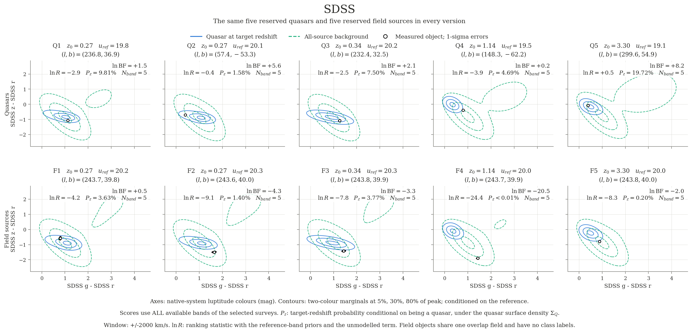](../../plots/examples/multisurvey/sdss.png)

## 2. DECaLS

[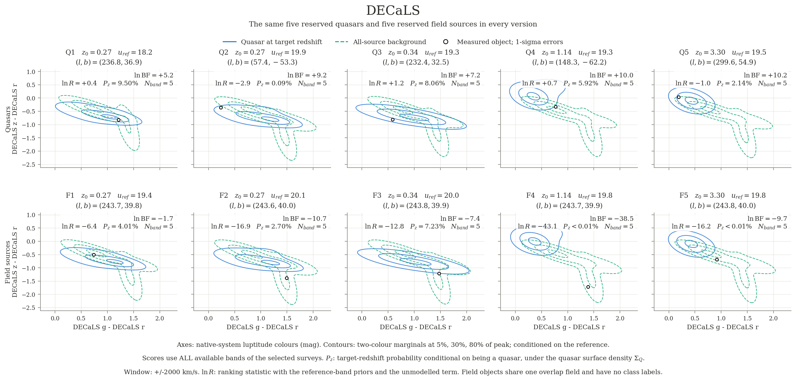](../../plots/examples/multisurvey/decals.png)

## 3. ALLWISE

[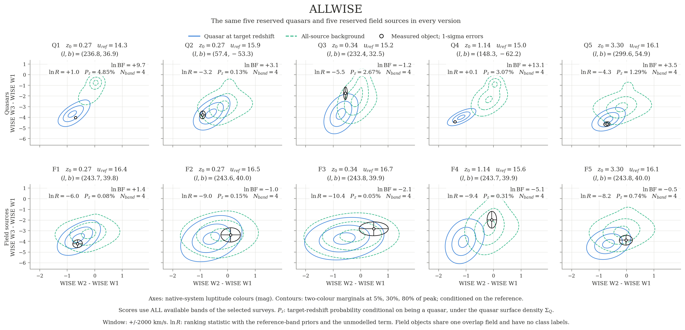](../../plots/examples/multisurvey/allwise.png)

## 4. PS1

[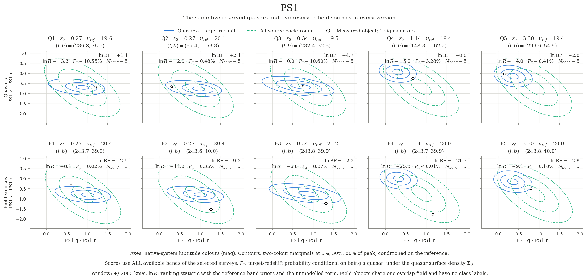](../../plots/examples/multisurvey/ps1.png)

## 5. NSC

[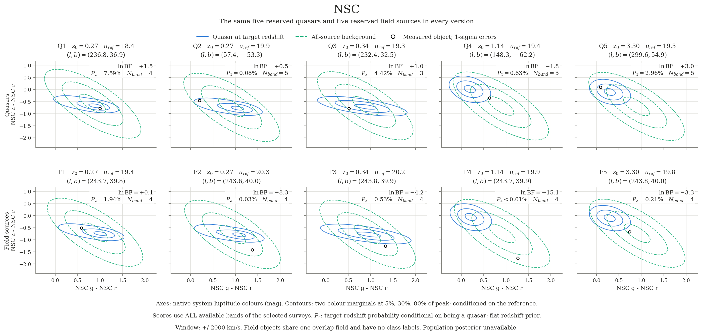](../../plots/examples/multisurvey/nsc.png)

## 6. SkyMapper

[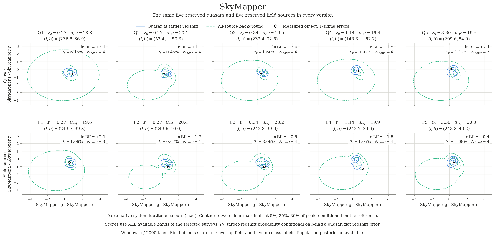](../../plots/examples/multisurvey/skymapper.png)

## 7. VHS

[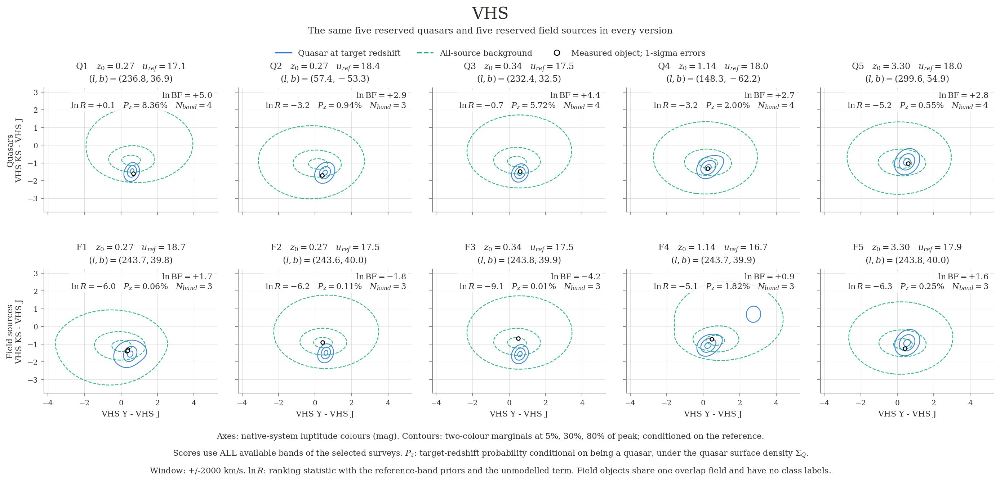](../../plots/examples/multisurvey/vhs.png)

## 8. DECaLS + ALLWISE

[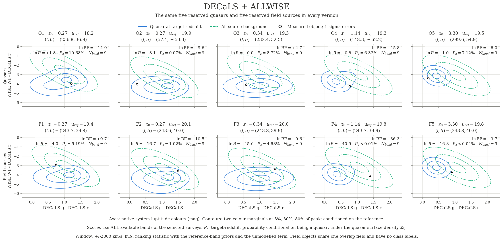](../../plots/examples/multisurvey/decals_allwise.png)

## 9. SDSS + ALLWISE

[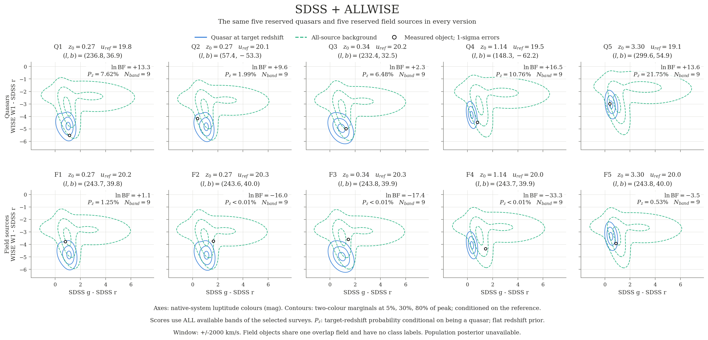](../../plots/examples/multisurvey/sdss_allwise.png)

## 10. PS1 + ALLWISE

[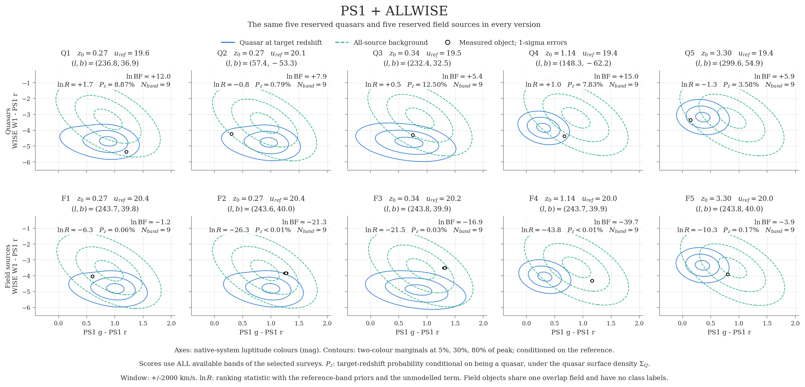](../../plots/examples/multisurvey/ps1_allwise.png)

## 11. ALLWISE + VHS

[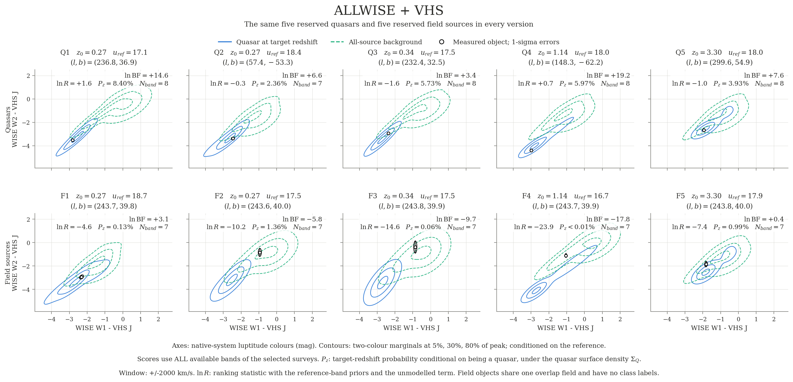](../../plots/examples/multisurvey/allwise_vhs.png)

## 12. All seven surveys

[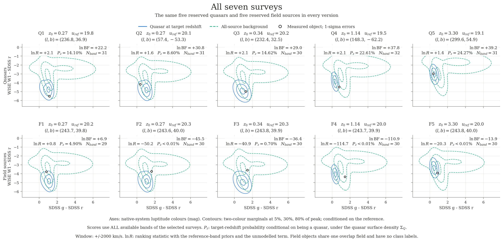](../../plots/examples/multisurvey/sdss_decals_allwise_ps1_nsc_skymapper_vhs.png)

## Reproduce

```bash
pip install -e ".[figures]"
python scripts/make_multisurvey_examples.py
```

The committed [sample](multisurvey_sample.json) contains all ten objects' native fluxes and variances, parent-cache hashes, source row numbers, and selection settings. The script uses the saved model and needs no WSDB access or training. `--reselect` deliberately regenerates the sample from the original local caches. The [configuration](../../configs/multisurvey_examples.json) declares the survey combinations, plotting bands, redshift window, and seed. [Exact scores](multisurvey_scores.json) record all 120 score rows, band lists, status and quality flags, plotted covariance matrices, and model/sample hashes. No model files are changed.
